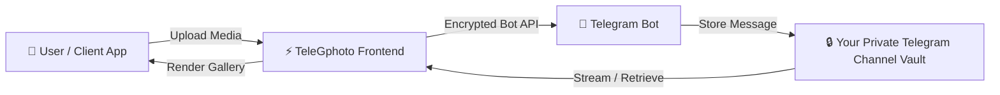

<div align="center">

  

  # 📸 TeleGphoto
  ### ☁️ Unlimited, Private & Free Google Photos Alternative

  <p align="center">
    <b>Transform Telegram's unlimited cloud storage into your personal, beautiful, and secure photo & document gallery.</b>
  </p>

  <p align="center">
    <a href="https://github.com/krishna3163/GooglePhoto_Alternative/releases"></a>
    <a href="https://github.com/krishna3163/GooglePhoto_Alternative/stargazers"></a>
    <a href="https://github.com/krishna3163/GooglePhoto_Alternative/network/members"></a>
    <a href="https://github.com/krishna3163/GooglePhoto_Alternative/blob/main/LICENSE"></a>
    
  </p>

  <br>

  <p align="center">
    <a href="#-quick-3-step-setup-guide"><b>🚀 Quick Setup</b></a> •
    <a href="#-telegphoto-vs-google-photos"><b>⚖️ Comparison</b></a> •
    <a href="#-key-features"><b>✨ Features</b></a> •
    <a href="#-installation--download"><b>📥 Download APK</b></a> •
    <a href="#-frequently-asked-questions"><b>❓ FAQ</b></a>
  </p>

</div>

<br>

---

## 💡 Why TeleGphoto?

Most commercial cloud storage services (like Google Photos, iCloud, Dropbox) enforce strict 15 GB limits and costly recurring subscriptions. 

**TeleGphoto** solves this by leveraging **Telegram's infinite cloud infrastructure** as a decentralized, zero-cost backend. Your files are stored in your **own private Telegram channel**, ensuring 100% data ownership, zero tracking, and completely unlimited storage.

<br>

## ⚖️ TeleGphoto vs Google Photos

| Feature | 📸 TeleGphoto | 🌐 Google Photos / Commercial Clouds |
|---|:---:|:---:|
| **Storage Capacity** | **♾️ Unlimited (Free Forever)** | ❌ 15 GB Free (Paid afterwards) |
| **Subscription Cost** | **$0 / Month** | ❌ $20 – $120+ / Year |
| **Privacy & Control** | **🛡️ 100% Client-Side Private Vault** | ❌ Scanned for Ads & AI Training |
| **Max File Upload** | **⚡ Up to 2,000 MB (2 GB) per file** | ⚠️ Deducted from quota |
| **Open Source** | **✅ 100% Free & Open Source (MIT)** | ❌ Closed Source Proprietary |
| **OCR Smart Text Search** | **✅ Built-in Client-Side OCR** | ✅ Cloud OCR |
| **PWA & Offline Mode** | **✅ Yes (Installable Web & Android APK)**| ✅ Native Apps |

<br>

---

## ✨ Key Features

- **🛡️ 100% Private & Self-Hosted**: No intermediary servers. All tokens, chat IDs, and encryption keys stay in your browser's local storage.
- **☁️ Unlimited Free Storage**: Upload high-resolution photos, 4K videos, raw audio, and PDF documents without paying for cloud storage.
- **🔍 Smart OCR Text Search**: Automatically reads text inside receipts, documents, and screenshots for instant keyword search.
- **🎨 Glassmorphic Modern UI**: Built with responsive dark mode, smooth gesture controls, and fluid micro-animations.
- **📁 Multi-Format In-Place Viewer**: Fullscreen preview and streaming support for `.jpg`, `.png`, `.mp4`, `.mkv`, `.pdf`, and zip files.
- **📱 Cross-Platform (PWA + APK)**: Install on Android, iPhone, Windows, or Mac with a single tap.

<br>

---

## 🏗️ How It Works (Architecture)



<br>

---

## 🛠️ Quick 3-Step Setup Guide

Setting up TeleGphoto takes less than **2 minutes**:

### 1️⃣ Step 1: Create your Telegram Bot
1. Open Telegram and search for [**@BotFather**](https://t.me/BotFather).
2. Send the message `/newbot`.
3. Give your bot a name and a username (e.g. `MyPhotoVault_bot`).
4. Copy your **HTTP API Token** (e.g. `7123456789:AAF_example_token_abc`).

### 2️⃣ Step 2: Create your Private Vault Channel
1. In Telegram, tap **New Channel** → Select **Private Channel**.
2. Go to **Channel Settings** → **Administrators** → **Add Admin** → Search your newly created bot and grant **"Post Messages"** permissions.
3. Post any test message (e.g. `hello`) in the channel, then forward that message to [**@userinfobot**](https://t.me/userinfobot) to get your **Chat ID** (starts with `-100`, e.g. `-1001234567890`).

### 3️⃣ Step 3: Connect & Enjoy!
1. Launch TeleGphoto on your browser or install the APK.
2. Enter your **Bot Token** and **Chat ID** in Settings.
3. Tap **Connect** — start uploading your unlimited photos and videos!

<br>

---

## 📥 Installation & Download

### 📱 Android Native App (APK)
Download the latest production release directly:
- **Download APK:** [`release/TeleGphoto_v1.0_Final.apk`](release/TeleGphoto_v1.0_Final.apk)
- Or download from the [**GitHub Releases Page**](https://github.com/krishna3163/GooglePhoto_Alternative/releases).

### 🌐 Install as PWA (Android / iOS / Desktop)
1. Open the web application URL in **Chrome** (Android/Desktop) or **Safari** (iOS).
2. **Android**: Tap the popup **"Install App"** or tap `⋮` → **Install Application**.
3. **iOS (iPhone/iPad)**: Tap the **Share** button `⎙` → Select **"Add to Home Screen"**.

### 💻 Local Developer Setup
```bash
# Clone the repository
git clone https://github.com/krishna3163/GooglePhoto_Alternative.git

# Navigate to web app directory
cd GooglePhoto_Alternative/web-app

# Install dependencies
npm install

# Start local development server
npm run dev
```

<br>

---

## 💻 Tech Stack

- **Core Framework**: React 18 + TypeScript
- **Styling**: Vanilla CSS (Tailored Glassmorphism Design System)
- **Animations**: Framer Motion
- **Icons**: Lucide React
- **Backend API**: Telegram Bot API
- **Build Tool**: Vite (Lightning fast HMR & PWA packaging)

<br>

---

## ❓ Frequently Asked Questions

<details>
<summary><b>🔒 Is my media private and secure?</b></summary>
<br>
Yes! Your media is stored directly in your personal private Telegram channel. No one has access to it except you and your bot. TeleGphoto runs entirely on client-side JavaScript without storing anything on external databases.
</details>

<details>
<summary><b>📦 Is there any file size limit?</b></summary>
<br>
Telegram Bot API allows uploading files up to <b>50 MB</b> via standard HTTP bot API, and up to <b>2,000 MB (2 GB)</b> via Telegram Local Bot API server.
</details>

<details>
<summary><b>💰 Can Telegram delete my files or charge me?</b></summary>
<br>
Telegram offers permanent cloud backup in personal channels for all accounts without expiry. As long as your Telegram account is active, your channel vault remains completely intact.
</details>

<br>

---

## 👥 Contributors & Open Source

Contributions, suggestions, and feedback are always welcome! Feel free to open an issue or submit a pull request.

<div align="center">
  <a href="https://github.com/krishna3163/GooglePhoto_Alternative/graphs/contributors">
    
  </a>
</div>

<br>

---

## 🤝 Connect & Feedback

Built with ❤️ by **Krishna Kumar**

<div align="center">

<a href="https://in.linkedin.com/in/krishna0858" target="_blank"></a>
&nbsp;
<a href="mailto:kk3163019@gmail.com" target="_blank"></a>
&nbsp;
<a href="https://wa.me/918210763241" target="_blank"></a>
&nbsp;
<a href="https://t.me/kk3163019" target="_blank"></a>
&nbsp;
<a href="https://github.com/krishna3163" target="_blank"></a>

</div>

<br>

---

## 📄 License

This project is licensed under the **MIT License** — see the [LICENSE](LICENSE) file for details.
